#  FPGA Watchdog Timer — Kiwi 1P5

> **Cuộc thi thiết kế FPGA/MCU 2026** — Bài thi Watchdog Monitor  
> Board: **Kiwi 1P5** (Gowin GW1N-UV1P5QN48)

##  Mục lục

- [Tổng quan](#tổng-quan)
- [Sơ đồ khối](#sơ-đồ-khối)
- [Cấu trúc project](#cấu-trúc-project)
- [Mô tả module](#mô-tả-module)
- [Register Map](#register-map)
- [Giao thức UART](#giao-thức-uart)
- [Pinout & Phần cứng](#pinout--phần-cứng)
- [Hướng dẫn build](#hướng-dẫn-build)
- [Hướng dẫn test](#hướng-dẫn-test)
- [Kịch bản test](#kịch-bản-test)

---

## Tổng quan

Watchdog Timer là mạch giám sát hoạt động của hệ thống. Nếu hệ thống không gửi tín hiệu "kick" (WDI) trong khoảng thời gian quy định (`tWD`), watchdog sẽ kích hoạt tín hiệu lỗi (WDO) để cảnh báo hoặc reset hệ thống.

### Tính năng chính

| Tính năng | Mô tả |
|---|---|
| **FSM 4 trạng thái** | IDLE → ARMING → RUNNING → FAULT |
| **Kick kép** | Nút nhấn S1 (WDI) hoặc UART command |
| **Enable kép** | Nút nhấn S2 (EN) hoặc UART register EN_SW |
| **Cấu hình qua UART** | Đọc/ghi 5 register: CTRL, tWD, tRST, arm_delay, STATUS |
| **Debounce phần cứng** | 2-FF synchronizer + debounce cho nút nhấn |
| **Timing có thể thay đổi** | tWD, tRST, arm_delay có thể thay đổi on-the-fly qua UART |
| **LED chỉ thị** | D3 = WDO (fault), D4 = ENOUT (running) |

---

## Sơ đồ khối

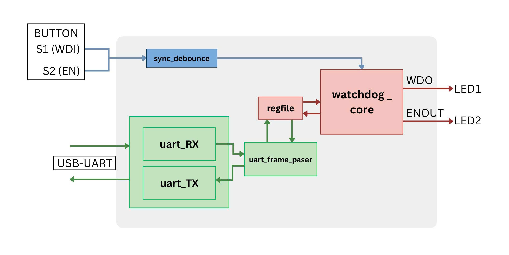

---

## Cấu trúc project

```
Watch_dog_timer/
├── Physical Constraints Files/ # Pin constraints cho Gowin EDA
│   └── kiwi1p5.cst             # Pin constraints
├── rtl/                        # RTL source code
│   ├── top.v                   # Top-level module (kết nối tất cả)
│   ├── watchdog_core.v         # FSM chính (IDLE/ARMING/RUNNING/FAULT)
│   ├── uart_rx.v               # UART Receiver 9600 8N1
│   ├── uart_tx.v               # UART Transmitter 9600 8N1
│   ├── uart_frame_parser.v     # Decode frame + XOR checksum + response
│   ├── regfile.v               # Register file (CTRL/tWD/tRST/arm_delay/STATUS)
│   └── sync_debounce.v         # 2-FF synchronizer + debounce nút nhấn
├── Testbench/                  # Testbench & Simulation files
│   ├── sim.do                  # ModelSim script
│   └── tb_top.v                # Testbench (5 test cases)
├── Timing Contraints Files/    # Timing constraints
│   └── kiwi1p5.sdc             # Timing constraints (27MHz clock)
├── Uart Python/                # Python scripts test UART
│   └── uart_test.py            # Python script test UART (full, interactive)
└── README.md                   # File này
```

---

## Mô tả module

### `watchdog_core.v` — FSM chính

Máy trạng thái 4 trạng thái:

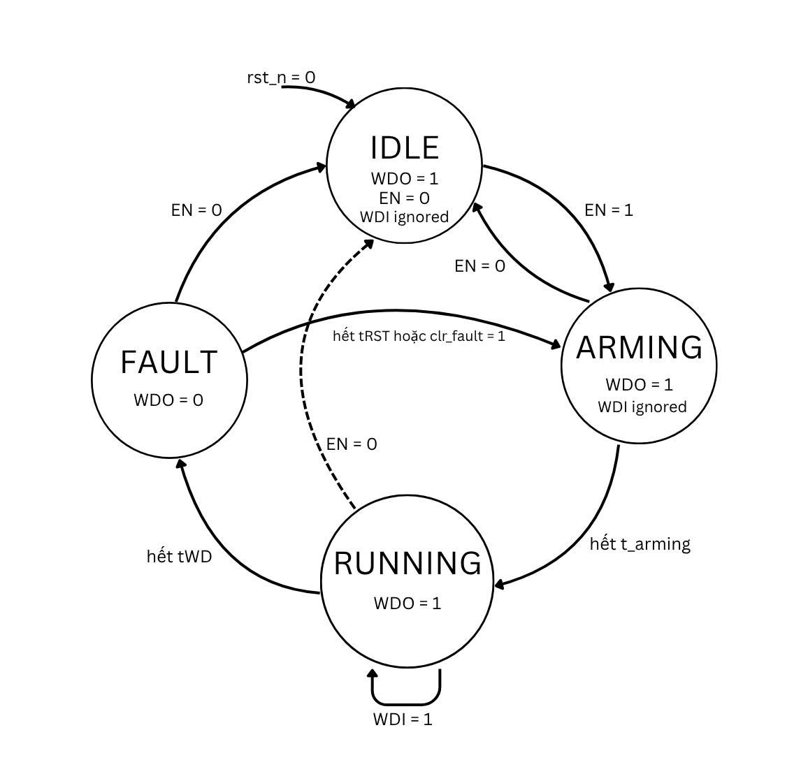

| Trạng thái | WDO_N | ENOUT | Mô tả |
|---|---|---|---|
| **IDLE** | 1 (OFF) | 0 (OFF) | Watchdog tắt, chờ EN |
| **ARMING** | 1 (OFF) | 0 (OFF) | Chờ `arm_delay_us`, bỏ qua WDI |
| **RUNNING** | 1 (OFF) | 1 (ON) | Hoạt động, đếm ngược tWD |
| **FAULT** | 0 (ON) | 1 (ON) | Timeout! WDO assert, đếm tRST |

### `uart_frame_parser.v` — Xử lý giao thức UART

Nhận frame từ PC, parse checksum, thực hiện lệnh, gửi response:

- **WRITE (0x01)**: Ghi giá trị vào register, ACK 5 bytes
- **READ (0x02)**: Đọc register, trả về 9 bytes (có data)
- **KICK (0x03)**: Kick watchdog qua UART, ACK 5 bytes
- **STATUS (0x04)**: Đọc STATUS register, trả về 9 bytes

### `regfile.v` — Register File

5 register quản lý cấu hình và trạng thái watchdog (xem [Register Map](#register-map)).

### `sync_debounce.v` — Đồng bộ + Debounce

- 2-FF synchronizer chống metastability
- Debounce counter
- Tạo pulse `btn_fall` khi **nhả nút** (falling edge of debounced signal)

### `uart_rx.v` / `uart_tx.v` — UART 9600 8N1

- Clock: 27MHz
- Baud: 9600 bps
- Format: 8 data bits, No parity, 1 stop bit

---

## Register Map

| Địa chỉ | Tên | R/W | Bit width | Mô tả |
|---|---|---|---|---|
| `0x00` | **CTRL** | R/W | 32 | bit0=EN_SW, bit1=WDI_SRC, bit2=CLR_FAULT (w1c) |
| `0x04` | **tWD_ms** | R/W | 32 | Watchdog timeout (ms). Default: **1600** |
| `0x08` | **tRST_ms** | R/W | 32 | WDO hold time khi fault (ms). Default: **200** |
| `0x0C` | **arm_delay_us** | R/W | 16 | Arm delay sau EN=1 (µs). Default: **150** |
| `0x10` | **STATUS** | R | 32 | Trạng thái hiện tại (xem bên dưới) |

### CTRL Register (0x00)

| Bit | Tên | Mô tả |
|---|---|---|
| 0 | `EN_SW` | Enable watchdog qua phần mềm (OR với nút S2) |
| 1 | `WDI_SRC` | 1 = chỉ nhận kick từ UART, 0 = nhận cả nút S1 |
| 2 | `CLR_FAULT` | Write-1-to-clear: xóa trạng thái FAULT |

### STATUS Register (0x10) — Read Only

| Bit | Tên | Ý nghĩa khi = 1 |
|---|---|---|
| 0 | `EN_EFF` | Watchdog đang enabled (EN_SW OR nút S2) |
| 1 | `FAULT` | Đang ở trạng thái FAULT |
| 2 | `ENOUT` | Watchdog đang RUNNING hoặc FAULT |
| 3 | `WDO` | WDO_N = 0 (fault output active) |
| 4 | `KICK_SRC` | Kick cuối cùng từ UART (1) hay nút (0) |

---

## Giao thức UART

| Thông số | Giá trị |
|---|---|
| Baud rate | 9600 bps |
| Data bits | 8 |
| Parity | None |
| Stop bits | 1 |

### Frame Format

```
TX (PC → FPGA):  [0x55] [CMD] [ADDR] [LEN] [DATA...] [CHK]
RX (FPGA → PC):  [0x55] [CMD] [ADDR] [LEN] [DATA...] [CHK]
```

| Trường | Kích thước | Mô tả |
|---|---|---|
| `0x55` | 1 byte | Sync byte (cố định) |
| `CMD` | 1 byte | 0x01=WRITE, 0x02=READ, 0x03=KICK, 0x04=STATUS |
| `ADDR` | 1 byte | Địa chỉ register (0x00, 0x04, 0x08, 0x0C, 0x10) |
| `LEN` | 1 byte | Số byte data (0 hoặc 4) |
| `DATA` | 0–4 bytes | Data (little-endian) |
| `CHK` | 1 byte | XOR checksum từ CMD đến hết DATA |

### Ví dụ

**KICK** (không data):
```
TX: 55 03 00 00 03
RX: 55 03 00 00 03    (ACK)
```

**READ tWD_ms** (addr=0x04):
```
TX: 55 02 04 00 06
RX: 55 02 04 04 40 06 00 00 42    (1600 = 0x00000640, LE)
```

**WRITE tWD_ms = 500**:
```
TX: 55 01 04 04 F4 01 00 00 F4
RX: 55 01 04 00 05               (ACK)
```

---

## Pinout & Phần cứng

### Board: Kiwi 1P5

| Chức năng | Tên trên board | Pin FPGA | Ghi chú |
|---|---|---|---|
| System Clock | Crystal X3 27MHz | 4 | Input clock |
| WDI (kick) | Button S1 | 35 | Active-low, pull-up on board |
| EN (enable) | Button S2 | 36 | Active-low, pull-up on board |
| WDO (fault) | LED D3 | 27 | Active-high (1 = sáng) |
| ENOUT | LED D4 | 28 | Active-high (1 = sáng) |
| UART RX | USB-UART | 33 | FPGA nhận từ PC |
| UART TX | USB-UART | 34 | FPGA gửi đến PC |

### Lưu ý phần cứng

- **LED active-high**: `1` = LED sáng, `0` = LED tắt (khác với schematic ghi active-low)
- **Nút nhấn active-low**: Nhấn = LOW, nhả = HIGH (có pull-up trên board)
- **EN logic**: Nhả nút S2 = watchdog **BẬT** (mặc định hoạt động)
- **USB-C UART**: Cổng USB-C **dưới** (GWU2U bridge)
- **USB-C JTAG**: Cổng USB-C **trên** (nạp bitstream)

---

## Hướng dẫn build

### Yêu cầu

- [Gowin EDA](https://www.gowinsemi.com/en/support/download_eda/) (Synthesize + Place & Route)
- [Gowin Programmer](https://www.gowinsemi.com/en/support/download_eda/) (nạp bitstream)
- [Python 3](https://www.python.org/) + [pyserial](https://pypi.org/project/pyserial/) (test UART)

### Bước build

1. Mở Gowin EDA, tạo project cho chip **GW1N-UV1P5QN48**
2. Add source files từ thư mục `rtl/`
3. Add constraint file `kiwi1p5.cst`
4. Add timing constraint `kiwi1p5.sdc`
5. **Synthesize** → **Place & Route** → **Program**
6. Nạp file `.fs` qua USB-C JTAG (cổng trên)

### Mô phỏng (ModelSim / Icarus Verilog)

```bash
# ModelSim
vsim -do sim.do
```

---

## Hướng dẫn test

### Cài đặt

```bash
pip install pyserial
```

### Kiểm tra cổng COM

```python
import serial.tools.list_ports
for p in serial.tools.list_ports.comports():
    print(p.device, p.description)
# Tìm cổng "GWU2U" 
```

### Chạy test

```bash
# Test cơ bản
python test_uart.py

# Test đầy đủ (interactive menu)
python uart_test.py --port COM9 --menu

# Test tự động
python uart_test.py --port COM9

# Test cụ thể
python uart_test.py --port COM9 --test 7 8
```

---

## Kịch bản test

### Tính toán giá trị timer

Công thức tính toán giá trị các bộ đếm (timer) dựa trên tần số xung nhịp hệ thống (System Clock) là $F_{clk} = 27 \text{ MHz}$.

- **Tần số System Clock:** $27 \text{ MHz} \Rightarrow 27,000,000$ chu kỳ/giây.
- **1 mili-giây (ms)** tương ứng với: $27,000,000 / 1000 = 27,000$ chu kỳ clock.
- **1 micro-giây (µs)** tương ứng với: $27,000,000 / 1,000,000 = 27$ chu kỳ clock.

Do đó, các giá trị mặc định được tính như sau:
1. **Thời gian chờ Arming (`arm_delay_us` = 150 µs):**
   - $150 \times 27 = \textbf{4,050}$ chu kỳ. (Giá trị đếm từ 4050 về 0)
2. **Thời gian Watchdog (`tWD_ms` = 1600 ms):**
   - $1600 \times 27,000 = \textbf{43,200,000}$ chu kỳ.
3. **Thời gian Reset/Fault (`tRST_ms` = 200 ms):**
   - $200 \times 27,000 = \textbf{5,400,000}$ chu kỳ.
   
### A. Test mô phỏng (ModelSim)


#### Test 1: Sau reset
- **Hành động:** Sau reset ở trạng thái Idle (State = 0), watchdog chuyển sang trạng thái Arming (State = 1).
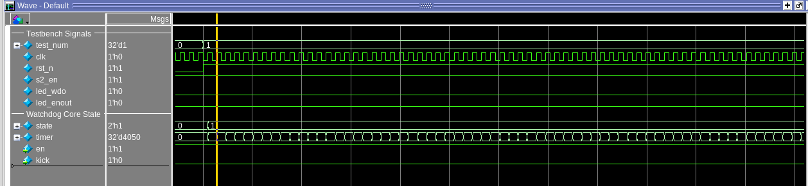
- **Kết quả:** Ở trạng thái Arming, bộ đếm đếm từ 4050. 
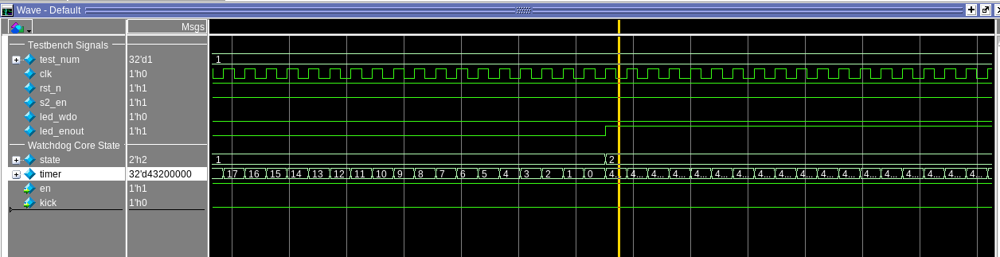
Khi Timer đếm xuống 0 sẽ chuyển sang trạng thái RUNNING, tín hiệu `en_out` được bật lên 1.
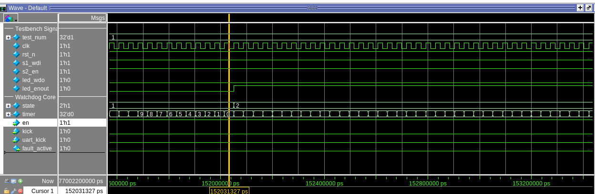

#### Test 2: Có kick khi ở trạng thái RUNNING
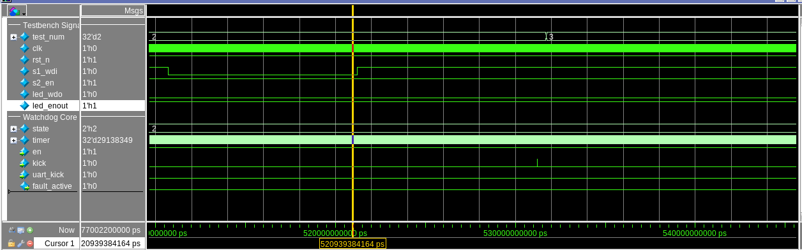
- **Hành động:** Nút `wdi` được nhấn rồi nhả. Sau khi nhả, đợi khoảng debounce 10ms, hệ thống sẽ kích tín hiệu `kick`.
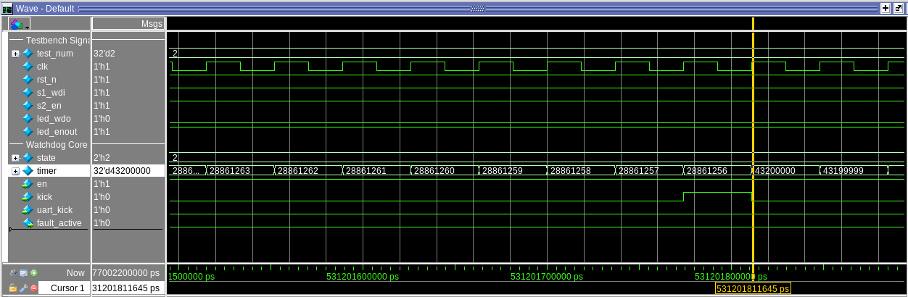
- **Kết quả:** Ở sườn xuống của tín hiệu `kick`, timer được reset và lặp lại chu trình đếm `tWD = 43_200_000`.

#### Test 3: Không có kick
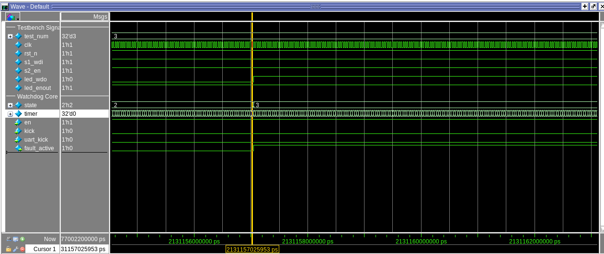
- **Hành động:** Khi không có tín hiệu kick, timer đếm về 0.
- **Kết quả:** Sau đó chuyển sang trạng thái FAULT (State = 3), đèn `wdo` sáng lên (từ 0 -> 1), `fault_active` cũng từ 0 -> 1. Timer được reset về `5_400_000` (tRST).

#### Test 4: Có kick trong trạng thái FAULT
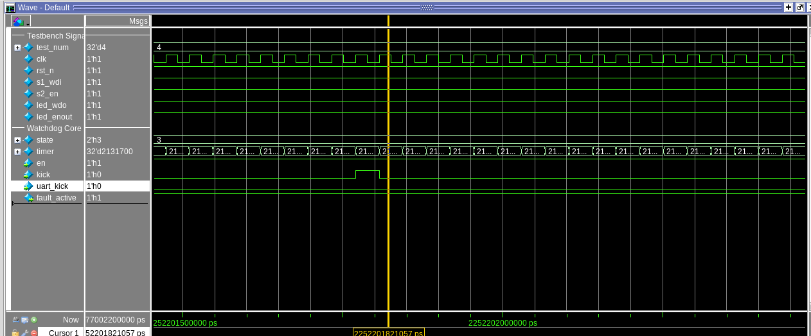
- **Hành động:** Gửi tín hiệu `kick` khi hệ thống đang ở trạng thái FAULT.
- **Kết quả:** Timer không bị reset, trạng thái không đổi (vẫn ở FAULT), LED `wdo` vẫn sáng. Tín hiệu `kick` không có tác dụng.

#### Test 5: Đang ở trạng thái FAULT chờ hết tRST
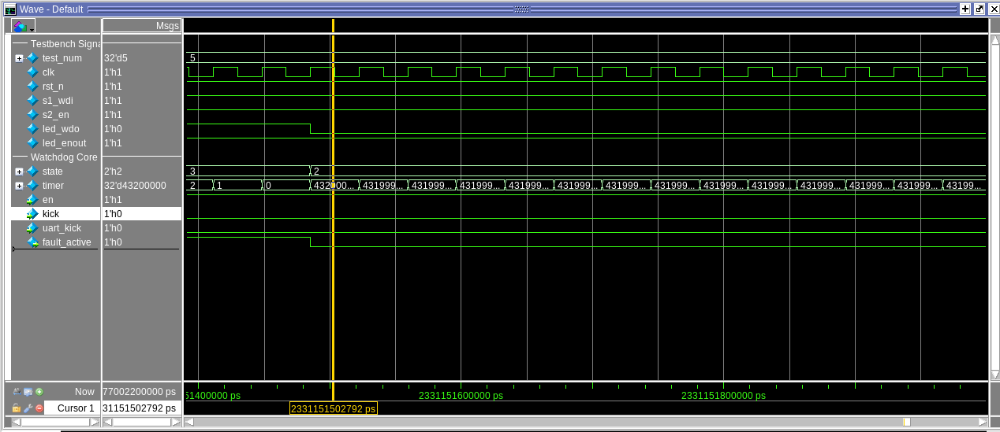
- **Hành động:** Bộ đếm thời gian reset (tRST) đếm về 0.
- **Kết quả:** Ngay tại xung clock tiếp theo, watchdog timer quay lại trạng thái RUNNING, LED `wdo` và `fault_active` bị đưa về 0. Timer được đặt lại về `43_200_000`.

#### Test 6: Nhấn nút EN
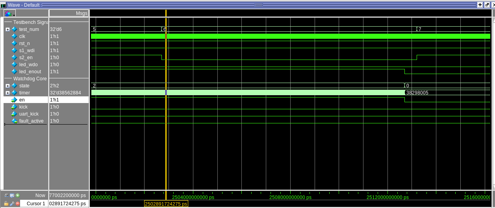
- **Hành động:** Nhấn nút `en`.
- **Kết quả:** Sau thời gian debounce 10ms, WDG bị đưa về trạng thái IDLE, tín hiệu `en` xuống 0 (WDG không hoạt động), `en_out` cũng bị đưa xuống 0.
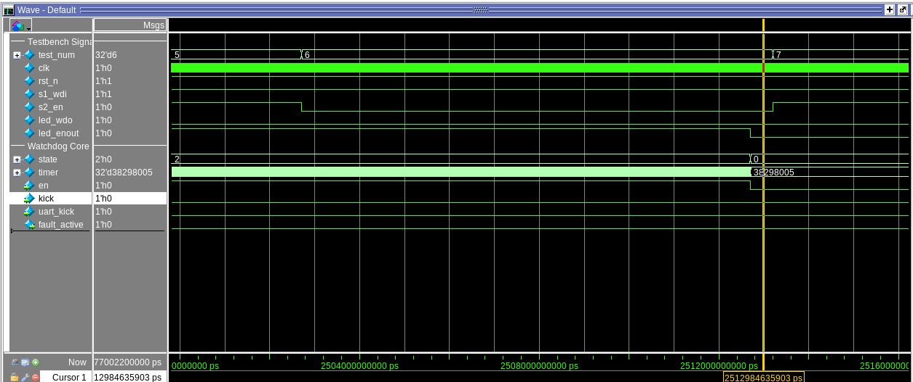
- **Phục hồi:** Sau khi nhả nút 10ms, WDG lại hoạt động bình thường, chuyển sang trạng thái ARMING sau đó sang RUNNING, `en_out` được bật lên.
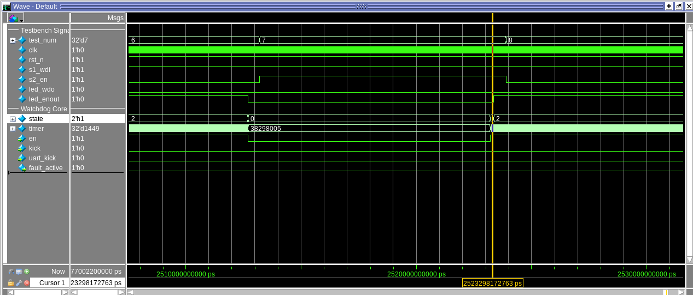

### B. Test phần cứng (nút nhấn + LED)

| # | Tên | Hành động | Kết quả mong đợi |
|---|---|---|---|
| 1 | Power-on | Nạp FPGA, không nhấn gì | D4 sáng, D3 sáng sau ~1.6s |
| 2 | Kick | Nhấn+nhả S1 mỗi <1.6s | D3 tắt, D4 sáng |
| 3 | Timeout | Không kick >1.6s | D3 sáng (FAULT), tắt sau 0.2s |
| 4 | Disable | Nhấn giữ S2 | Cả 2 LED tắt |
| 5 | Kick trong FAULT | Nhấn S1 khi D3 sáng | D3 vẫn sáng (kick bị bỏ qua) |
| 6 | Disable xóa FAULT | Giữ S2 khi FAULT | FAULT bị xóa, 2 LED tắt |

### C. Test UART (Python)

| # | Tên | Lệnh | Kết quả mong đợi |
|---|---|---|---|
| 7 | Đọc default | `read_reg(0x04)` | tWD = 1600 |
| 8 | Ghi/Đọc | `write_reg(0x04, 3000)` → `read_reg(0x04)` | Đọc lại = 3000 |
| 9 | EN_SW | `write_reg(0x00, 0x01)` | D4 sáng (enable qua UART) |
| 10 | UART Kick | `kick()` liên tục | D3 tắt |
| 11 | CLR_FAULT | `write_reg(0x00, 0x05)` | Xóa FAULT, D3 tắt |
| 12 | Timing | `write_reg(0x04, 500)` | D3 nhấp nháy nhanh hơn |

---

## Thiết kế ngõ ra WDO

Trong thiết kế hiện tại (file `top.v`), ngõ ra `WDO` được cấu hình theo dạng **Push-Pull** thay vì Open-Drain Emulation:
```verilog
// Sử dụng Push-Pull để điều khiển trực tiếp LED
assign wdo_led_n = ~wdo_val;
```
Thiết kế sử dụng Push-Pull nhằm cấp dòng điện trực tiếp giúp điều khiển đèn LED hiển thị lỗi trên board Kiwi 1P5 mà không cần mắc thêm điện trở kéo (pull-up resistor) bên ngoài.

---

## Thông số mặc định

| Tham số | Giá trị | Đơn vị |
|---|---|---|
| `tWD_ms` | 1600 | ms |
| `tRST_ms` | 200 | ms |
| `arm_delay_us` | 150 | µs |
| System Clock | 27 | MHz |
| UART Baud | 9600 | bps |

---

## License

MIT License

---

## Tác giả

**HungHocHanh** — Cuộc thi thiết kế FPGA/MCU 2026
